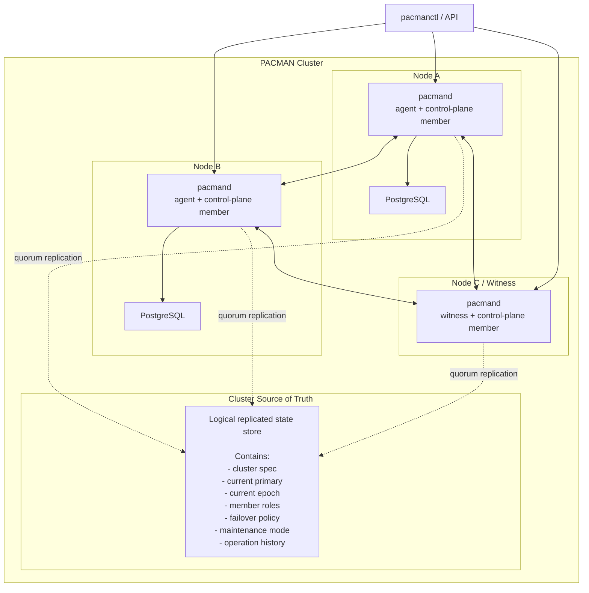

# PACMAN

**PACMAN** — **Postgres Autonomous Cluster Manager**

PACMAN is a Go-based high-availability cluster manager for PostgreSQL.

It focuses on a small but important goal: provide safe and understandable PostgreSQL HA with automatic failover, controlled switchover, and explicit rejoin of failed primaries.

---

## Why

PACMAN is built around a few core ideas:

- PostgreSQL HA should be treated as a distributed system problem
- cluster-wide decisions must not be made by a single node in isolation
- topology changes should be explicit state transitions
- the cluster must have one authoritative source of truth
- failover must be quorum-based and fencing-aware

---

## Architecture

PACMAN has two main parts:

- **Node agent** — runs on each PostgreSQL node, observes local state, and executes commands
- **Control plane** — maintains cluster state, elects a leader, and decides failover/switchover

## API Contract

A draft OpenAPI contract for the control-plane API lives in [docs/openapi.yaml](docs/openapi.yaml).
It is intentionally inspired by Patroni's operational REST patterns, but adapted to PACMAN's explicit cluster-centric model.
