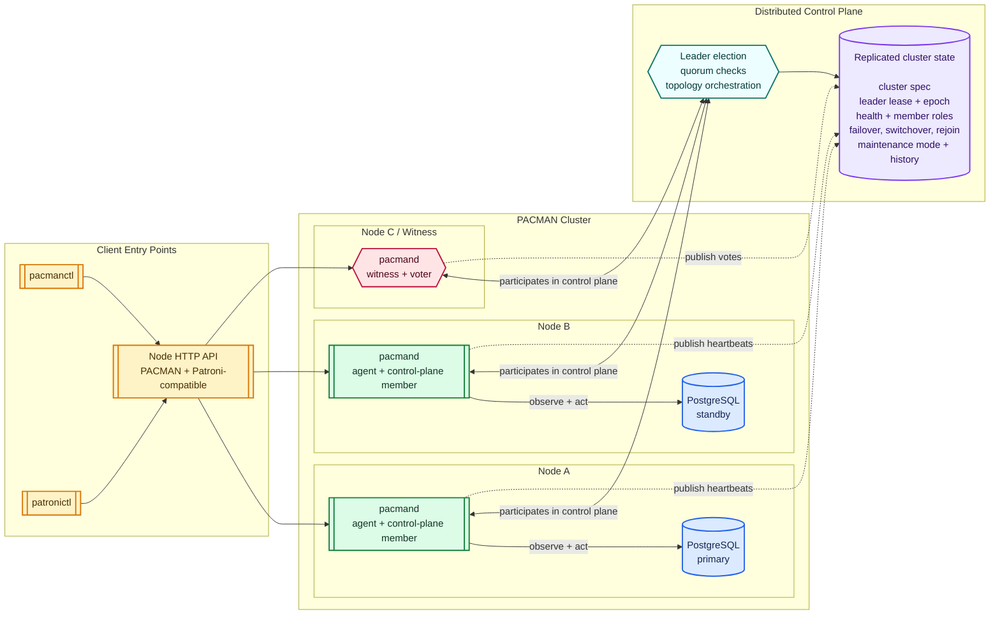

# PACMAN Architecture Overview

**PACMAN** — **Postgres Autonomous Cluster Manager**

PACMAN is a Go-based high-availability cluster manager for PostgreSQL.

Its purpose is to manage a PostgreSQL cluster as a distributed system with:

- a local agent on each node,
- a cluster-wide control plane,
- a replicated source of truth,
- and explicit state transitions for failover, switchover, and rejoin.

---

## Goals

PACMAN is designed to provide:

- automatic failover,
- safe planned switchover,
- explicit rejoin of failed primaries,
- deterministic cluster state transitions,
- and a simpler operational model for PostgreSQL HA.

The main design principle is that **cluster-wide decisions must never be made by a single node in isolation**.

---

## High-Level Architecture

PACMAN consists of two main layers:

### 1. Node Agent

A local daemon running on every PostgreSQL node.

Responsibilities:

- observe local PostgreSQL state,
- collect health and replication information,
- manage PostgreSQL lifecycle,
- execute promote / demote / rejoin actions,
- report observed state to the control plane.

### 2. Cluster Control Plane

A distributed control component responsible for cluster-wide decisions.

Responsibilities:

- maintain the cluster source of truth,
- elect a control-plane leader,
- evaluate cluster health,
- decide when failover is allowed,
- select the best promotion candidate,
- coordinate topology transitions,
- track operation history.

---

## Architecture Diagram

For the pluggable DCS (distributed configuration store) design, see [ARCHITECTURE_DCS.md](ARCHITECTURE_DCS.md).

For the Kubernetes-native deployment model, see [ARCHITECTURE_K8S.md](ARCHITECTURE_K8S.md).
